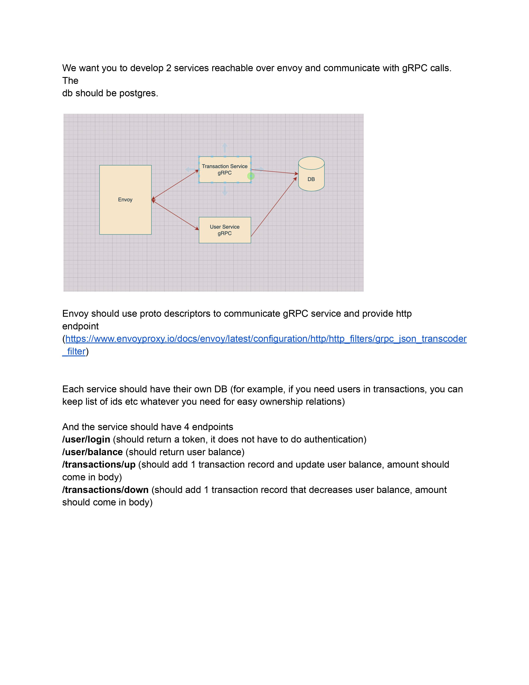

# Envoy gRPC JSON transcoder with 2 Golang services 
#### _takes in HTTP JSON request - transcodes to gRPC with Envoy proxy and sends requests to different Golang services connected to Postgresql Databases_

## The Task


## Running the services
`cd` into both the service directories (go-txnmgmt-grpc, go-usermgmt-grpc) and run 
```sh
go mod tidy
```
this will install dependencies and packages. 
Now, Create two postgresql databases and update the connection strings of the servers of both the service 
> go-usermgmt-grpc > usermgmt_server > usermgmt_server.go > func main() > database_url
> go-txnmgmt-grpc > txnmgmt_server > txnmgmt_server.go > func main() > database_url

If the proto files are changed then generate `.pb` file with this example command _(assuming protoc already installed)_
```sh
protoc -I txnmgmt/googleapi/ -I txnmgmt/ --include_imports --descriptor_set_out=txnmgmt/txnmgmt.pb txnmgmt/txnmgmt.proto
```
& generate `pb.go` file with
```sh
protoc -I txnmgmt/googleapi/ -I txnmgmt/ txnmgmt/txnmgmt.proto --go_out=plugins=grpc:txnmgmt
```

Now, run the services with 
```sh
go run go-usermgmt-grpc/usermgmt_server/usermgmt_server.go
go run go-txnmgmt-grpc/txnmgmt_server/txnmgmt_server.go
```

To avoid complexity I didn't use any go client - instead I used [Insomnia](https://insomnia.rest/download) to make gRPC calls. [check this video](https://www.youtube.com/watch?v=fzxtEbal2vg) for help.
## Running Envoy

Finally, use given `yaml` file to transcode RESTful JSON API to gRPC using Envoy
```sh
envoy --config-path transcode_to_gRPC.yaml
```

Now, test the endpoints using the given `json` collection file in the `http-request-collection` directory & see the ✨Magic✨

_N.B. Being new in Golang, I didn't add dependency folders to .gitignore in fear of version mismatch issues. Due to this cloning may take longer than expected_

